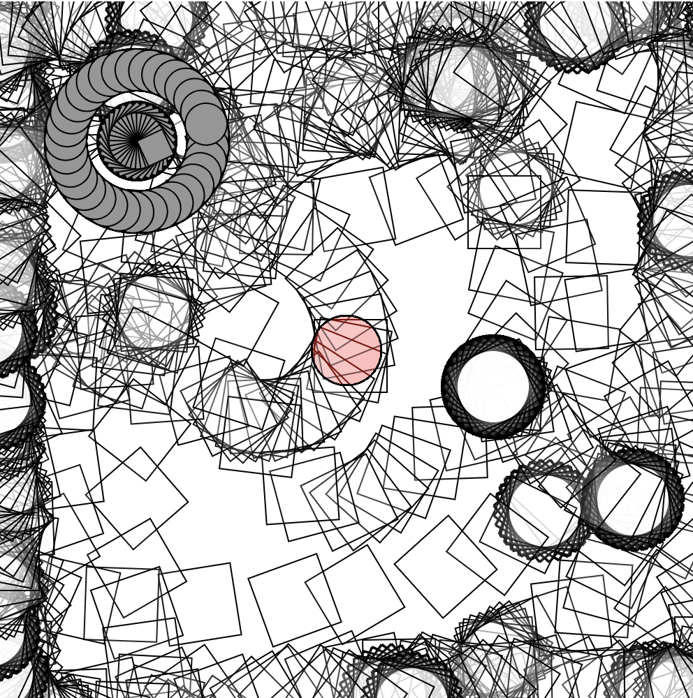

# MA1805 [PROJECT TITLE HERE}

Replace the text prompts (including this one), and write a few sentences under each heading to describe your project - around 200 words for the entire document. 

Reference the following where appropriate:
Actions, Rules, Goals, Objects, Environment, Aesthetic, User/Player.

## Core theme

What is the project/game about?

## Objective

Can you win and lose? 
Is it to enage with an idea? 
Is it to explore particular aesthetics/mechnics?

## Influences 

Highlight any influence(s), proving images and/or links. 

## Aesthetics

What will the project/game look like? What aesthetic will you be using? Consider saving any concept art/images into the assets folder.

## Mechanics

What actions will be available? What objects will be included on the canvas? What kinds of movement or interactivity will you employ? Hiow do things change over time? 

## Image 

 